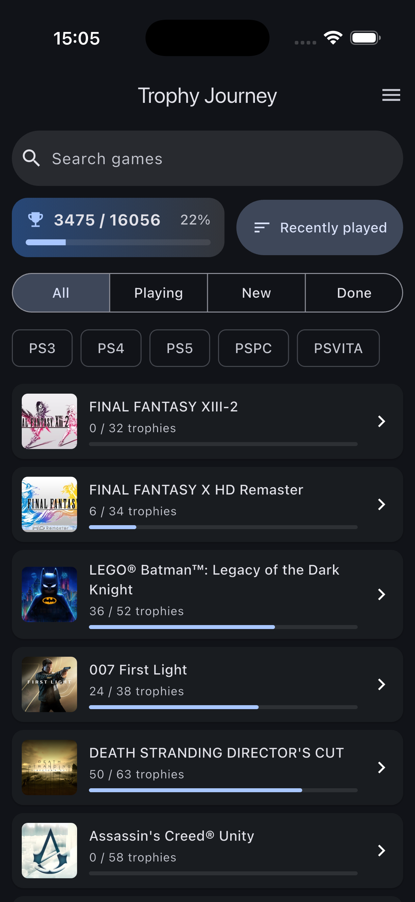
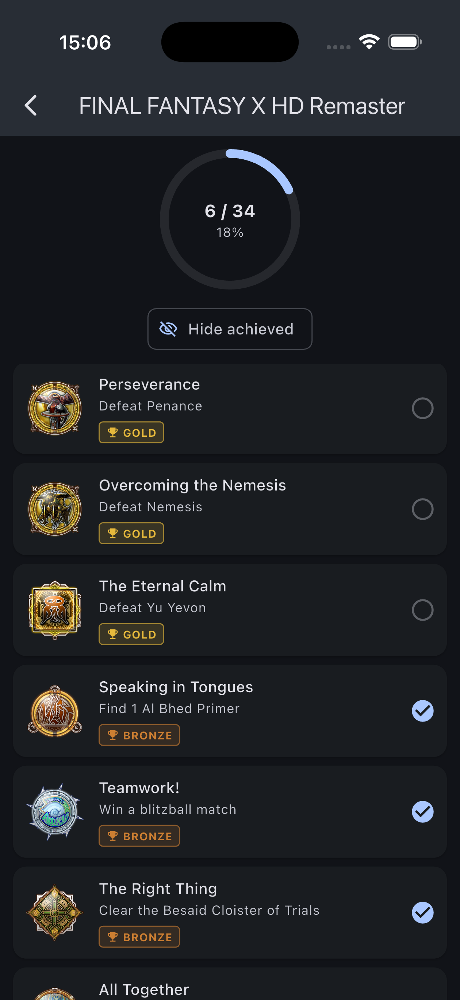

# Trophy Journey

## Overview

A Flutter app for tracking your PlayStation trophies. Sign in with your PSN
account and the app shows your trophy library with earned progress synced
straight from Sony's servers. Games are enriched with bundled guide content —
trophy guide text, missable flags — and _journeys_: hand-written step-by-step
platinum walkthroughs with checkable tasks.




## Features

- **Sign in with PSN** — an in-app web view opens Sony's sign-in page and
  intercepts the OAuth authorization code from the redirect (the flow
  impersonates the official PlayStation app, the only client Sony issues
  mobile tokens to). Tokens are kept in secure storage and refreshed
  automatically.
- **Your PSN library** — the game list is your actual trophy library,
  sorted by last played, with cover art, per-game progress bars, and an
  overall trophy count.
- **PSN-synced progress** — earned trophies come from PSN and are
  read-only in the app; an animated progress circle shows completion per
  game.
- **Trophy lists** with icons, bronze/silver/gold/platinum badges, a red
  **MISSABLE** badge, filters for missables-only and hiding earned
  trophies, and a detail screen with the full guide text.
- **Guide content** — bundled guides
- **Journeys** — a step-by-step walkthrough per game. Each step has
  instructions and tasks; tasks link to the trophies they unlock and can be
  flagged _missable_ or _recommended_. Tasks are checkable, and a bookmark
  remembers where you are. (Currently available for Final Fantasy X HD.)
- **Offline-friendly** — PSN responses are cached in SQLite, so the
  library and trophy lists keep working without a connection.

## Technologies

_Flutter_ | _Dart_ | _PlayStation_API_ | _ChangeNotifier_ | _InheritedNotifier_

## Usage

```sh
flutter pub get
flutter run
```

Run the tests with:

```sh
flutter test
```
